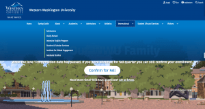

A significant overhaul of the header/splash area. This change should not affect menu structure or any content on the page, and should not result in any breaking changes or down time for the majority of sites. However, a small handful of sites will need to have a few page level blocks moved into a new region.

## What changed

* The Make Waves version of the logo will now be used across all sites
* Some university quick links have been moved. Calendar, Directory, and Map are now located in the (dark blue) University footer.
* Site names have been relocated to be more prominent
* The main navigation has been moved above the splash area, and there are some cosmetic style changes

## What did not change

* The main menu content, functionality, or structure
* The placement of items in the splash area (in other words, the area with a photo, and any headlines or content that appears in that section)
* Anything in the content regions between the splash area and the university footer

In addition to the header change, version 3.0.0 now uses Pa11y hooks to run automated accessibility checks on development branches before they are pushed to the repository. See section "Accessibility Testing in Ashlar" of the readme for more information on how these checks run.