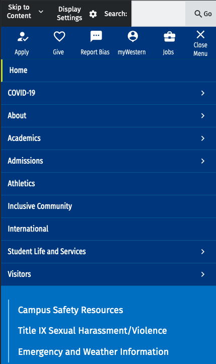
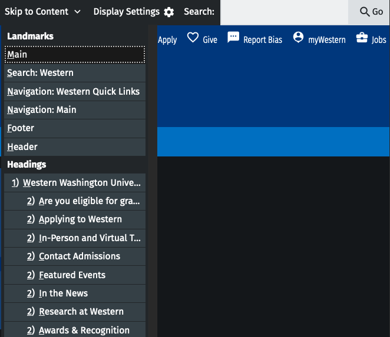

## 4.2.8
**April 11, 2022**

* A11y fixes for Ultimenu and taxonomy term styles

## 4.2.6-4.2.7
**April 6, 2022**

* Layout template fix for homepage
* Dark mode css fix for cards
* Accordion fix for views
* Views filter a11y fix

## 4.2.5
**March 21, 2022**

* Apple touch icon added
* Styles for new directory, homepage navigation

## 4.2.4
**March 14, 2022**

* Performance improvements for skip to link
* Heading structure fixes for aggregator feeds
* Removal of deprecated Ashlar library

## 4.2.2-4.2.3
**March 7, 2022**

* Breadcrumb cacheing issue fix

## 4.2.1
**February 28, 2022**

* A11y patch for visually hidden text running together
* A few css fixes

## 4.2.0
**February 22, 2022**

The display settings and search will be moved up to a new, pre-header bar. Additionally, the skip to content link will become visible without requiring focus. There has also been a new "Jobs" quick link added to the menu.

Mobile:

Desktop: 

The mobile menu layout and animation will change from a sliding animation to a fading animation, and the layout of the Western Quick links will change slightly. The site and Western footers will also now be visible when the mobile menu is open:

The skip to content button now also has additional navigation functionality, for jumping to various headers on a page.

