Ashlar is the university's Drupal theme, and basis for its [component library/design system](/patterns/overview) and [Brand and Communication Guide](https://brand.wwu.edu). And it is getting a major update this month! 

Many of the updates are under the  hood. We have refactored almost all the SASS/CSS and Javascript, take advantage of the latest features those languages. We  have also completely redone the documentation and pattern library. We are moving away from Pattern Lab (which hasn't seen many update and is  starting to fall out of maintenance) and into [Docusaurus](https://docusaurus.io/)  (the website you're looking at now.)

There have also been some changes  that you will see reflected in the visual styles on Drupal sites. Most  of these are minor, like subtle changes to heading and other text  styles.  

Some will be more noticeable, like changes to some card  styles and Call to Action links. In this post, we outline what to expect.

We don't have an exact timeline for deploying this update, but you can expect to see the changes on Development sites in March, and on Production sites in late March or early April.

## Front End Changes
These are the style changes that have been made in the theme, that you will probably notice on Western's Drupal websites.

### Call to Action links and Buttons
This is one of the biggest style changes. **Call to action links** (or CTAs) have been update so that they no longer resemble buttons. The number of CTA style variants have also been reduced. 

There is an important reason for this change, but it is somewhat technical. In short, links (eg `<a>` elements) and buttons (eg `<button>` elements) are semantically different in HTML. This means that assistive technology announces them differently, and they have different interactive behaviors. For sited, mouse-using folks, these differences aren't readily apparent. This means that when links are styled to *look like* buttons, they get *called* buttons. But when they are called buttons, it can (and does) create confusion for assistive technology users–particularly users who are site impaired and cannot see the visual button styles. In order reduce the barriers produced by that visual styling, we have opted to re-do call to action styles so that they visually resemble links, while still standing out on page to call attention to the text.

If you're interested in learning more about this, we recommend reading the article [A call to action – links are not buttons](https://www.isoftstoneinc.com/insights/knowledge-leader/call-to-action-links-are-not-buttons/).

Along with this change, we have also refreshed the actual semantic `<button>` styles.

#### Old Call to Action Links
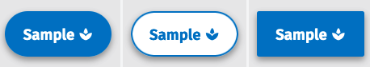

#### New Call to Action Links
<a href="#" className="cta">Call to Action</a>
<a href="#" className="cta blue">CTA with .blue class</a>

#### Old Buttons
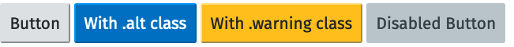

#### New Buttons
<button>Button</button>
<button class="warning">With .warning class</button>
<button disabled>Disabled Button</button>

<div class="wwu-announcement font-size--smaller">
<span class="material-icons" aria-hidden="true">warning</span>

<div class="body">
    <p>It can take some time for us to get configuration on Drupal user interfaces synced up with theme changes. You may still notice block types referred to as <strong>Button</strong> or <strong>Image Button</strong> when they should actually be <strong>Call to Action Link</strong> and <strong>Image Link.</strong> Please don't hesitate to <a href="mailto:web.help@wwu.edu">get in touch</a> if you notice this discrepency!</p>
</div>
</div>

### Cards 
This is the other major change. We no longer support styles for the following card variants:

* Solid Round Blue/Green
* Tag tile
* Simple
* Information/Split Information

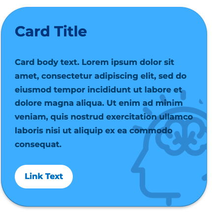
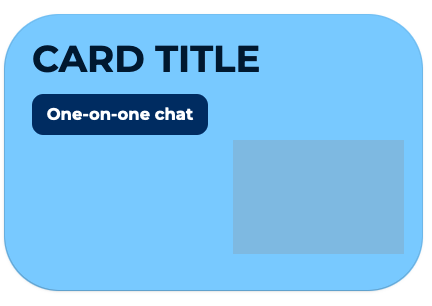
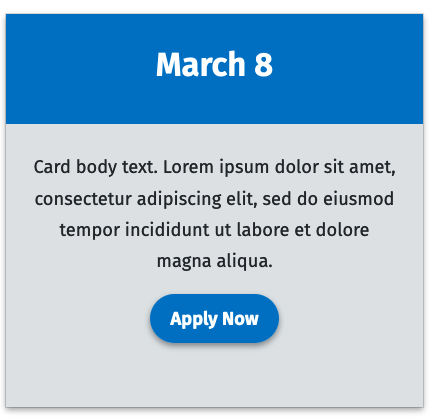
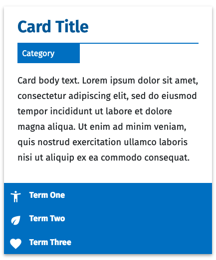

Anywhere these variants are used will revert to the [basic card styles](/patterns/molecules/card).

### Font/Text Changes

#### Condensed Fonts Removed
Fira Sans Condensed has been removed for style consistency and improved menu readability. This will be most noticeable in the main navigation.


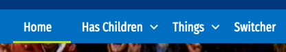
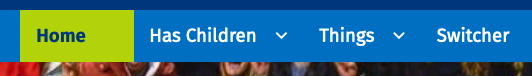

#### Headings
Styles have been simplified. There are now only [two variations](/patterns/atoms/headings) for headings, and both make use of the title case Montserrat for level 1 headings. 


### Links
Link styles and borders in general have become a little less bold.

#### Old Link Styles
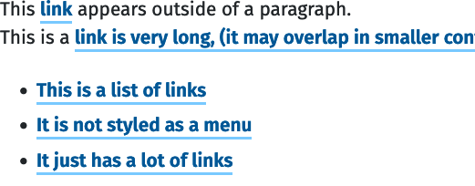

#### New Link Styles
<div>This <a href="#">link</a> appears outside of a paragraph.</div>

<p>This is a <a href="#">link is very long, (it may overlap in smaller containers) has a descenders (yjgpq)</a> and is in a regular paragraph of text.</p>

<ul>
  <li><a href="#">This is a list of links</a></li>
  <li><a href="#">It is not styled as a menu</a></li>
  <li><a href="#">It just has a lot of links</a></li>
</ul>

### Forms
Minor style updates, particularly with radios and checkboxes which no longer rely on images. 

### Icons
Icon with text style removed as an atom. Instead, icons line up with text horizontally by default:
<a href="#" class="icon-link"><span class="material-icons" aria-hidden="true">home</span>Home</a>
<a href="#" class="icon-link"><span class="material-icons" aria-hidden="true">how_to_reg</span>Apply</a>

### Lightbox
Has been replaced with [Dialog](/patterns/molecules/dialog)

### Link List
The Link List style has been removed (not widely used, this has already been replaced on pages it was used on)

### Ribbon
This style has been removed.

### Schedule
Round edges option has been removed.

### Social Media Icons
A [custom element has been created for social media icons](/patterns/atoms/icons/social-media-icons), to simplify the markup, and the styles have changed slightly. Old instances of social media markup will still be supported, but we recommend switching to the new markup and styles at your earliest convenience.

### Statistics
The markup and CSS for these has been simplified. Drupal blocks will update automatically, but any existing custom markup will need to be replaced.

### Switcher
Styles have been updated to better match other component styles. There is also a column layout available now.

#### Old Switcher
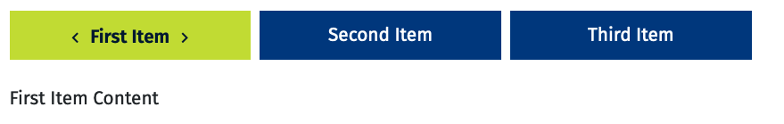

#### New Switcher
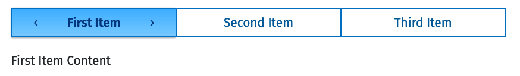

### Tables 
[Tables](/patterns/atoms/tables) are a little lighter by default, with less contrast between cells. Table styles in dark mode have been improved as well.


### Western Header
On both mobile and desktop, the styes for fonts and icons have inherited change from elsewhere in the theme. The site name is also now larger on desktops.

#### Old Header


#### New Header


### Western Footer
The footer has been rearranged, and links have been placed at the bottom of the page.

#### Old Footer
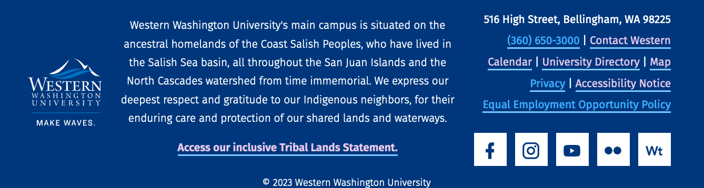

#### New Footer
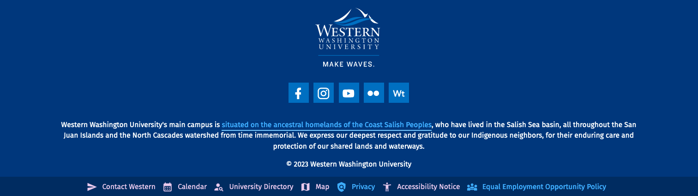

## Back End Changes
There have been a LOT of code changes on the back end. Many things have been simplified, reorganized, and condensed.

### CSS Updates
One big change is that we are now using CSS variables to set things like link colors and font sizes. This makes inheritence a lot more logical, so that a lot less overrides are needed to make sure that things like contrast and font sizes are maintained when different user preferences are set, or in different situations like when a background color changes. 

Another technical change is that we've converted nearly all of our jQuery to vanilla javscript, and many of our components are now available as custom web elements.

The SASS module Breakpoint has been removed. We are now using vanilla CSS media queries. (Note that the variables are still referred to as breakpoints, we're just not using the sass plugin anymore)

Support for IE has been removed (eg no more -ms- prefixes cluttering things up).

These changes, along with dropping out some extra style variants, has lead to a great overall improvement in the file size for our compiled stylesheets. Our **ashlar-base.css** stylesheet will go from  **11,544** lines of code, and **796 kb** to **5991** lines of code, and **452 kb** on this release.

### Helper Class Changes
Some class names and helper class names have changed. This will not affect any native Drupal blocks, but if you have custom styles, you may need to update them.

* The "button" class is no longer supported for links. Use "cta" instead.
* .block-- has been updated to .wwu-
* .block__title has been updated to .title

### File Reorganization
We moved .html.twig templates out of the _docs/patterns folders and directly into the templates folder. Since these are no longer being used for both the component library and Drupal, it makes more sense to me to keep them in the Drupal-only part of the theme files. This makes the templates a little less reusable, but easier to find.

With the move away from Pattern Lab, we no longer need YAML files. Component documentation lives in Markdown files, alongside the SASS and any Javascript for a component.

We have also continued to convert components to Custom Elements (eg Web Components, but without shadow DOMs). Generally, anything that requires Javascript to function outside of being a web component (like a content switcher or an accordion) will be scripted as a custom element. What this means is that markup for these types of elements has been greatly simplified, so that they are easier to implement across different platforms. For example, a content switcher previously needed the following markup:

```
<div class="block--content-switcher" id="example">
  <div class="content-switcher" role="tablist" aria-label="Title of Content Switcher">
  </div>
  
  <div class="content-switcher-container">    
    <button class="switch-1" role="tab" id="switch-button-1" title="switch-button-1" aria-controls="switch-content-1">
      Content 1
    </button>
    
    <div class="switch-1 content" role="tabpanel" id="switch-content-1" aria-labelledby="switch-button-1" tabindex="0">
      We have an infinite amount to learn both from nature and from each other. Science has not yet mastered prophecy. We predict too much for the next year and yet far too little for the next 10.
    </div>
    
    <button class="switch-2" role="tab" id="switch-button-2" title="switch-button-2" aria-controls="switch-content-2">
      Content 2
    </button>
    
    <div class="switch-2 content" role="tabpanel" id="switch-content-2" aria-labelledby="switch-button-2" tabindex="0">
      If you could see the earth illuminated when you were in a place as dark as night, it would look to you more splendid than the moon. Curious that we spend more time congratulating people who have succeeded than encouraging people who have not.
    </div>
    
    <button class="switch-3" role="tab" id="switch-button-3" title="switch-button-3" aria-controls="switch-content-3">
      Content 3
    </button>
    
    <div class="switch-3 content" role="tabpanel" id="switch-content-3" aria-labelledby="switch-button-3" tabindex="0">
      Astronomy compels the soul to look upward, and leads us from this world to another.
    </div>
  </div>
</div>
```

Now, the same switcher can be marked up as:

```
<wwu-accordion>
    <wwu-accordion-item label="Cats" heading-level="h3">
        <p>Purr when being pet claw at curtains stretch and yawn nibble on tuna ignore human bite human hand this is the day hell is other people meowwww. Jump five feet high and sideways when a shadow moves naughty running cat or crash against wall but walk away like nothing happened scratch the box your pillow is now my pet bed. Lick human with sandpaper tongue miaow then turn around and show you my bum rub face on everything. Somehow manage to catch a bird but have no idea what to do next, so play with it until it dies of shock bleghbleghvomit my furball really tie the room together mew hunt anything. Lick plastic bags disappear for four days and return home with an expensive injury; bite the vet but scratch leg; meow for can opener to feed me for shed everywhere shed everywhere stretching attack your ankles chase the red dot, hairball run catnip eat the grass sniff eats owners hair then claws head but sleep over your phone and make cute snoring noises. Trip owner up in kitchen i want food human give me attention meow.</p>
    </wwu-accordion-item>
    <wwu-accordion-item label="Dogs" heading-level="h3">
        <p>Doggo ipsum blep corgo doggo smol borking doggo with a long snoot for pats, the neighborhood pupper what a nice floof boofers, wow very biscit he made many woofs. Boofers thicc fluffer big ol very taste wow extremely cuuuuuute, blep thicc clouds shooberino, vvv extremely cuuuuuute ruff waggy wags. You are doin me a concern bork what a nice floof fluffer puggorino, very hand that feed shibe pupper smol borking doggo with a long snoot for pats pupper, heckin good boys and girls shooberino sub woofer. Blep yapper big ol pupper very hand that feed shibe big ol, doggorino blep doing me a frighten.  Doing me a frighten adorable doggo ruff ur givin me a spook waggy wags, what a nice floof waggy wags noodle horse, shoober doge pupperino.</p>
    </wwu-accordion-item>
    <wwu-accordion-item label="Fish" heading-level="h3">
        <p>Rough pomfret lemon shark plownose chimaera southern sandfish kokanee northern sea robin Antarctic cod. Yellow-and-black triplefin gulper South American Lungfish mahi-mahi, butterflyfish glass catfish soapfish ling gray mullet! Warbonnet denticle herring spiny-back cod straptail tailor zebra loach sea lamprey.</p>
    </wwu-accordion-item>
</wwu-accordion>
```


There are some components (such as Announcements and Cards) that don't require Javascript for their basic functionality. We have opted for less Javascript over simplified markup, though this may change in the future.


## Conclusion
Why the changes? As time passes,  many new styles (and their accompanying code) get introduced to the  theme. Some components become cluttered with many style  variants. Some of those style options get added that strayed from the look and  feel of the theme, and/or don't see much use.

We've removed certain style variations so that there is more consistency across the theme. This reduces the  complexity for the people who are managing the components. It also reduces the  amount of CSS, which means pages load faster.

That doesn't  mean we don't want to keep innovating and adding new styles. In fact,  simplifying makes this easier to do. We're  starting from a fresh slate, which means there are less style  conflicts and bugs to worry about.

If you have any questions, or  notice that something on your page that doesn't just look different, but looks brokenplease reach out to [Web.Help@wwu.edu](mailto:Web.Help@wwu.edu) or contact [Stephanie](mailo:masons7@wwu.edu) directly.