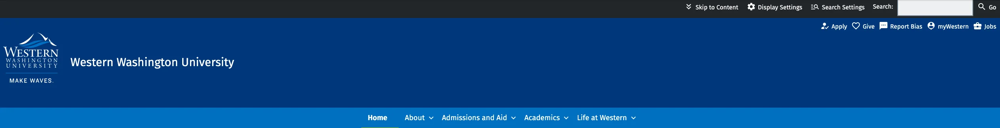
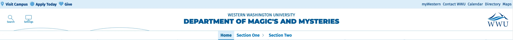
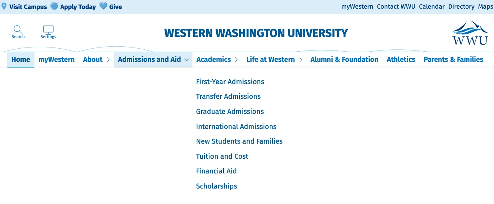
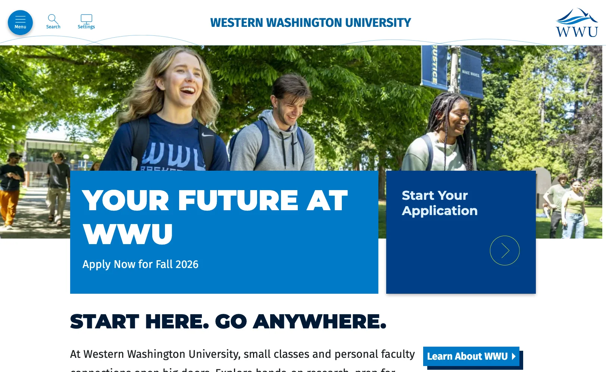
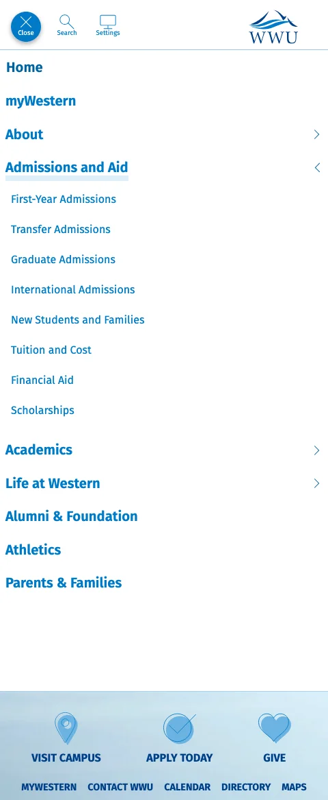
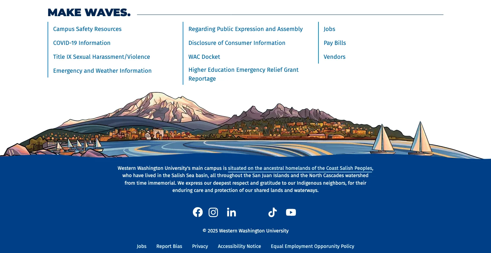
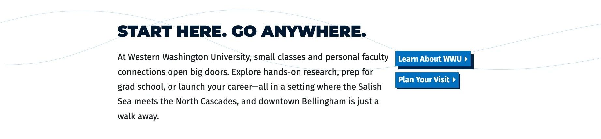

## 6.0.0
### September 10, 2025 - Major Theme Update! 

WebTech and University Marketing have been working for the past 10 months on a major visual overhaul of Western's Design system and Drupal/Wordpress/Standalone app theme. The most obvious changes with this update are the with the Western Header and Footer, but there are a number of visual updates to block types and components as well. This update is being rolled out to select sites at the beginning of next week. At the time that it goes live on these sites, it will become available on an opt-in basis to other Drupal sites. In December 2025, we will be rolling the theme update out to all Drupal sites. If you would like to opt in to the theme update now, you can 

#### Header and main navigation changes
The header has been totally overhauled so that it better utilizes space. 

Old:

New:

#### New menu option

The default setting for the new main navigation looks and operates the same way it does now, but with style updates:

We have also introduced a "hamburger always on" option, in which the navigation is toggled by the "menu" button:

This option better accommodates larger menus with a lot of sub-menu options, and allows users to more quickly see the content of the page. [You can learn how to enable the hamburger always on option here](https://webtech.wwu.edu/blog/how-change-menu-systems-ashlar-6).

No matter which option is enabled, on smaller screens/mobile devices, the menus will continue to utilize the menu toggle:

#### New footer styles
Our new footer features beautiful artwork by local artist Gretchen Leggitt

This update includes changes to the site footer regions that often contain custom content. Most of this content should adapt well to theme changes, but images and identity marks that appear in this area may need to be updated to better suit the background color.

#### Theme color updates

In order to simplify and unify the theme visually, the [theme colors](/patterns/atoms/color) have been updated, and essentially reverted to an earlier standard. The medium green has been removed and yellow has been added back. Light green is still available, but it's use on the web has been reduced. For Drupal sites, the available **background colors** on various block types have changed, to reduce visual clutter.

#### Component style updates

There have been some style updates to components such as [links](/patterns/atoms/links), [call to action links](/patterns/atoms/links/call-to-action), [announcements](/patterns/molecules/announcement), and [images with descriptions](/patterns/molecules/image-with-description). 

#### Section Classes

As we roll out the new theme, we are also rolling out a new feature: Section Classes. These allow you to set background colors and styles on layout **sections** in addition to blocks. This will allow for multiple column layouts with colored backgrounds.

#### Other changes
The old set up for "box headlines" has been deprecated, it is now a [style variant on banners](/patterns/molecules/banner). In the long run this should be easier to use. WebTech will handle any conversions from the old set up, and new style options will be added in the future.
